# 예약과 웨이팅을 한번에! Chairing


# 📌 프로젝트 소개
**Chairing**은 사용자들에게 방문 대기를 대신하거나 원하는 식당에 예약을 제공하는 플랫폼입니다. 효율적인 대기 및 예약 프로세스를 통해 사용자에게 편리함을 제공합니다.

## **대기 등록 프로세스**
- 이름, 연락처 인원 정보를 간단히 입력하여 대기 등록 완료.
- 시스템 내 실시간 대기 현황을 통해 사용자는 편리한 서비스 경험 제공.

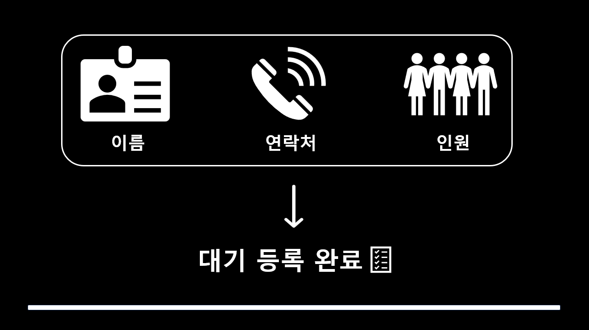

## **간편한 예약 시스템**
- 날짜와 시간, 인원 선택만으로 손쉽게 예약 가능.
- 사용자는 대기 없이 원하는 시간에 맞춰 서비스를 이용 가능.

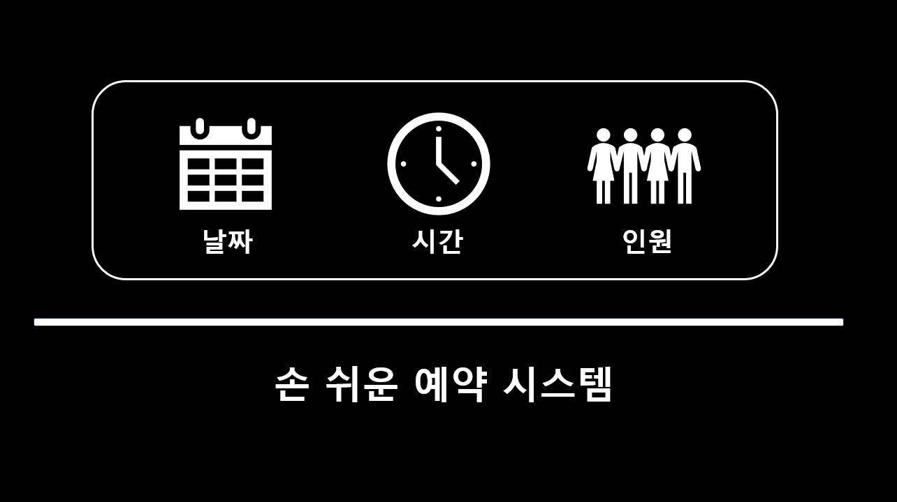


## **매장 효과**
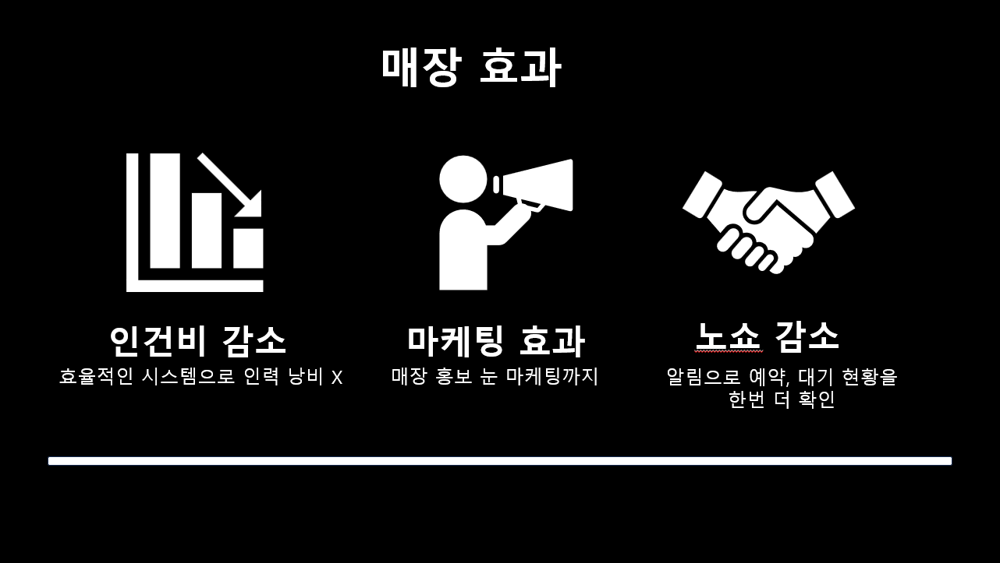
---

# 👥 팀원 소개

| 이름                                                                 | 역할                | 주요 구현 기술                           |
|----------------------------------------------------------------------|-------------------|------------------------------------|
| [**장민우**](https://github.com/JANG-MINWOO)                        | 실시간 메시지, CI/CD, Redis 최적화 | Redis Pub/Sub, WebSocket, GitHub Actions |
| [**정다운**](https://github.com/ethrad)                             | 예약 기능, 푸시 알림      | Redis zset, FCM, Transactional Outbox |
| [**장문석**](https://github.com/jangms3)                            | 캐싱 관리, CI/CD      | `@Cacheable`, `@CacheEvict`, Redis 최적화 |
| [**이한식**](https://github.com/coldrice99)                         | 동시성 제어 및 성능비교     | Redis RedissonClient               |
| [**심윤호**](https://github.com/syh21133)                           | 회원 관리, 이미지 업로드, 모니터링 | AWS S3, CloudFront, Prometheus/Grafana |

---

# 🛠 기술 스택

<table style="border-collapse: collapse; width: 100%; table-layout: fixed; text-align: center;">
  <thead>
    <tr>
      <th style="padding: 15px;">분류</th>
      <th style="padding: 15px;">기술</th>
    </tr>
  </thead>
  <tbody>
    <tr>
      <td style="padding: 20px; font-weight: bold;">Language</td>
      <td>
        
      </td>
    </tr>
    <tr>
      <td style="padding: 20px; font-weight: bold;">Version Control</td>
      <td>
        
        
      </td>
    </tr>
    <tr>
      <td style="padding: 20px; font-weight: bold;">IDE</td>
      <td>
        
      </td>
    </tr>
    <tr>
      <td style="padding: 20px; font-weight: bold;">Database</td>
      <td>
        
        
        
        
        
      </td>
    </tr>
    <tr>
      <td style="padding: 20px; font-weight: bold;">Framework</td>
      <td>
        
        
        
        
      </td>
    </tr>
    <tr>
      <td style="padding: 20px; font-weight: bold;">Cooperation Tools</td>
      <td>
        
        
      </td>
    </tr>
    <tr>
      <td style="padding: 20px; font-weight: bold;">Infrastructure</td>
      <td>
        
        
        
        
        
      </td>
    </tr>
    <tr>
      <td style="padding: 20px; font-weight: bold;">Library</td>
      <td>
        
        
        
        
      </td>
    </tr>
    <tr>
      <td style="padding: 20px; font-weight: bold;">Monitoring</td>
      <td>
        
        
        
        
      </td>
    </tr>
    <tr>
      <td style="padding: 20px; font-weight: bold;">API Test</td>
      <td>
        
        
        
      </td>
    </tr>
  </tbody>
</table>

---

# 🏛 아키텍처

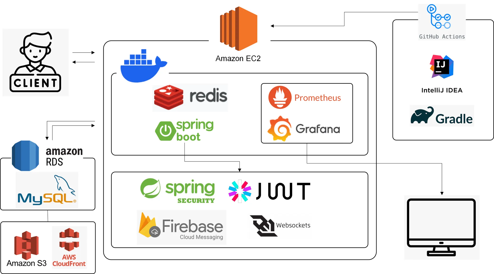

## 1. 주요 구성 요소
- **서버**: Spring Boot 기반의 백엔드 서버
  - API 제공 및 데이터 처리
  - 예약 및 웨이팅 상태 관리
- **데이터베이스**: MySQL
  - 사용자 및 가게 데이터 저장
  - 웨이팅 및 예약 기록 관리

## 2. 데이터 흐름
1. 사용자가 어플리케이션에서 웨이팅 또는 예약 요청.
2. 요청은 REST API를 통해 서버로 전달.
3. 서버는 요청을 처리하고 데이터베이스에 저장.
4. 사용자는 WebSocket을 통해 실시간 상태 알림을 수신.

## 3. 배포 구조
- **AWS EC2**: 서버 배포
- **AWS S3**: 정적 이미지 파일 저장
- **AWS RDS**: 데이터베이스 호스팅 (MySQL)
- **CI/CD 파이프라인**: GitHub Actions를 활용한 자동 배포

---

# 📊 ERD

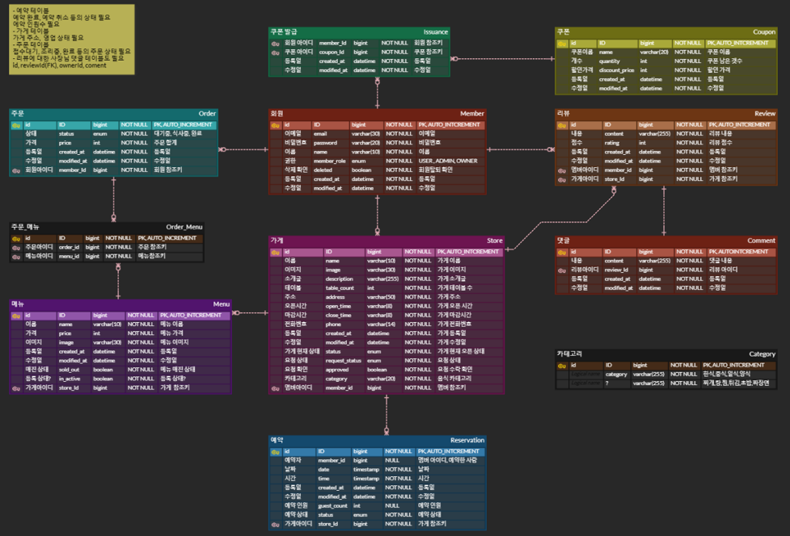

---

# 🌟 주요 기능

## 1. 예약 및 웨이팅
- 예약 기능 CRUD
- 실시간 대기자 목록 조회

## 2. 알림 시스템
- 푸시 알림: 예약 상태 변경 시 사용자 알림
- 실시간 메시징: WebSocket을 통한 상태 업데이트

## 3. 캐싱 및 최적화
- Redis를 활용한 인기 가게 캐싱 및 성능 최적화

## 4. 회원 관리 및 이미지 업로드
- 회원 정보 관리 (회원가입, 수정, 탈퇴)
- AWS S3를 통한 이미지 업로드

---

# 🔍 기술적 의사 결정

<details>
<summary><strong>Redis 캐시</strong></summary>

[문제 인식]

- 평소 API 응답 속도가 **평균 500ms**로 측정되었고, 트래픽이 증가할수록 응답 속도가 더 느려지는 문제가 발생했습니다. 이를 해결하기 위해 성능 저하 원인을 다음과 같이 구체적으로 분석했습니다

<전체 가게 jmeter 부하 테스트 >

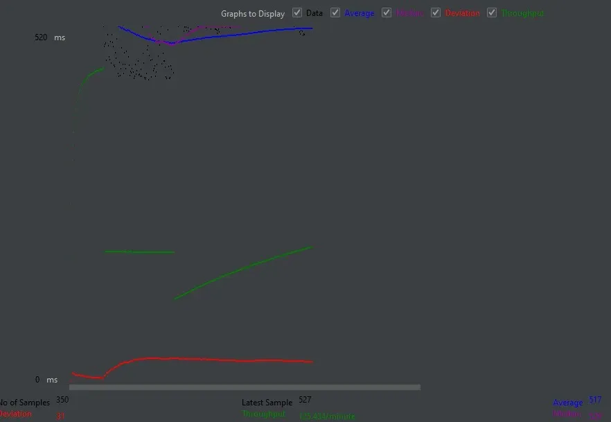

**[첫 번째 그래프: "전체 가게 조회 관련 부하 테스트"]**

- **평균 응답 시간 (Average)**: **517ms**로 캐싱 미적용 상태에서 DB 접근이 성능의 병목 현상을 초래.
- **최신 샘플 응답 시간**: **527ms**로 여전히 높은 수준.
- **처리량 (Throughput)**: **125,434 requests/minute**로 캐싱 적용 사례보다 낮음.
- **편차 (Deviation)**: **31ms**로, 요청 간 응답 시간의 변동성이 존재.

> 결론: 캐싱 미적용 상태에서는 높은 트래픽 처리에서 성능 저하가 발생.
>

<전체 가게 캐싱 jmeter 부하 테스트 >

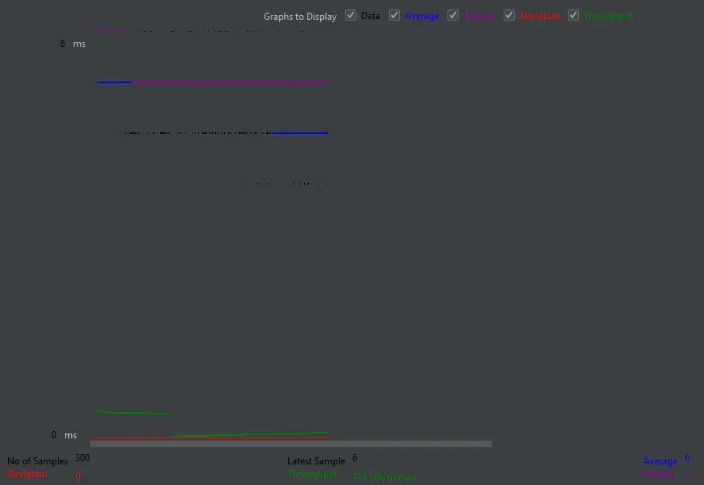

<캐싱을 적용한 전체 가게 조회>

**[두 번째 그래프: "캐싱 적용한 전체 조회"]**

- **평균 응답 시간 (Average)**: **6ms**로 매우 낮게 유지. 캐싱 적용으로 DB 접근 없이 빠르게 데이터를 반환.
- **최신 샘플 응답 시간**: **6ms**로 일관된 성능 유지.
- **처리량 (Throughput)**: **148,189 requests/minute**로 높은 처리량을 처리하며 안정적인 성능 제공.
- **편차 (Deviation)**: **0**으로, 모든 요청에서 응답 시간이 일관됨.

> 결론: 캐싱 도입의 효과로 빠르고 안정적인 응답 성능을 보장.
>

1. **성능 저하 원인 분석**:
  - **중복 데이터 접근**:
    - 동일한 데이터를 여러 사용자 요청에서 반복적으로 조회하고 있었습니다.
    - 데이터베이스에 과도한 부하를 유발하며, 응답 속도를 저하시킴.
  - **비효율적인 데이터 로드**:
    - 가게의 상세 정보와 리뷰 데이터를 함께 조회하는 로직에서, 필요 이상의 데이터를 불필요하게 로드하고 있었습니다.
2. **기존 문제로 인한 영향**:
  - **응답 시간 증가**:
    - 평균 응답 시간 500ms에서 트래픽이 많아질 경우 최대 1,000ms 이상까지 응답 시간이 증가.
  - **사용자 경험 저하**:
    - 응답 시간이 느려질수록 사용자 이탈률이 증가하고, 특히 모바일 환경에서는 심각한 UX 저하로 이어짐.
  - **서버 부하**:
    - 데이터베이스 CPU 및 메모리 사용량이 급격히 증가하며, 서버 과부하로 이어지는 사례가 관찰됨.
3. **해결 방안 도출**:
  - 위 문제를 해결하기 위해 **캐싱(Cache)**을 도입하여 데이터 접근 방식을 최적화하기로 결정.
  - 캐싱은 다음과 같은 방식으로 문제를 해결했습니다:
    - redis cache 도입 : @Cacheable 어노테이션을 사용하여 Redis 캐시를 활용하도록 설정.
    - TTL 을 10분으로 설정하여 캐시 데이터의 갱신 주기를 제어
    - **적용 대상 API**:
      - `getAllOpenedStores` 메서드: 전체 가게 목록 조회 시 결과를 Redis에 저장.
      - `getStoreDetails` 메서드: 특정 가게의 상세 정보를 Redis에 저장하며, 캐시 키에 가게 ID를 포함하여 데이터 일관성 유지.
    - **캐시 저장 로직**:
      - `@Cacheable`:
        - 가게 목록 조회 및 상세 조회 시 DB 호출 없이 Redis에서 캐시된 데이터를 반환.
        - 캐시에 데이터가 없을 경우 DB에서 데이터를 조회한 후 Redis에 저장.
      - `@CacheEvict`:
        - 가게 정보가 수정되거나 삭제되는 경우, 관련 캐시 데이터를 제거하여 최신 상태를 유지.
    - **Redis 캐싱 적용 후 성능 개선**:
      - 기존에는 모든 요청이 데이터베이스로 전달되어 다중 쿼리가 실행됨으로써 평균 응답 시간이 500ms 이상으로 측정.
      - Redis 캐시 적용 후, 동일한 데이터를 반복적으로 조회하는 요청은 캐시에서 응답하여 평균 응답 시간이 **6ms**로 감소.

4. **캐싱 도입 이후 기대 효과**:
  - **N+1 문제 해결**:
    - 가게 목록과 상세 정보, 리뷰 데이터를 한 번 캐싱하여 DB 중복 호출을 제거.
  - **응답 시간 단축**:
    - 캐싱된 데이터를 통해 평균 응답 시간을 500ms → 6ms로 단축.
  - **서버 안정성 개선**:
    - 데이터베이스 호출 수가 감소하여 CPU 및 메모리 사용량을 대폭 줄임.
5. **만약 로컬 캐시를 ?**
  - Local Cache는 빠른 속도와 간단한 운영이 장점이지만, 분산 환경에서는 데이터 일관성이 부족.
  - Redis 같은 Global Cache는 데이터 일관성과 확장성에서 더 유리.


6.   **Local Cache를 사용할 경우 DB와 동기화 방법은?**

- **Write-Through**: 캐시와 DB를 동시에 업데이트.
- **Write-Behind**: 캐시에 먼저 쓰고, 이후 DB를 비동기로 업데이트.
- **Pub/Sub**: Global Cache에서 업데이트 이벤트를 Pub/Sub으로 Local Cache에 전달.
- **Eviction**: 일정 주기로 캐시 데이터를 삭제하여 최신 데이터 유지.

> 결론: 위와 같은 구체적인 원인 분석과 캐싱 도입의 결과로 성능 개선 목표를 명확히 설정하고, 이를 성공적으로 달성할 수 있었습니다. 추가적인 테스트와 최적화를 통해 지속적으로 성능을 모니터링하고 개선할 계획입니다.
>

</details>

<details>
<summary><strong>인기 가게 조회 캐싱</strong></summary>

[문제 인식]

### 1. **데이터베이스 부하 문제**

- 인기 가게 데이터를 매 요청마다 실시간으로 데이터베이스에서 조회하면, 높은 트래픽 상황에서 DB에 과도한 부하가 발생할 수 있습니다.
- 예를 들어, 검색 트래픽이 몰릴 경우 DB의 쿼리 응답 시간이 증가하며, 이는 사용자 경험의 저하로 이어질 수 있습니다.

### 2. **데이터 최신성 문제**

- 인기 가게 데이터는 지속적으로 업데이트되지만, 실시간 업데이트를 요구하면 높은 자원 소모가 발생합니다.
- 반면, 캐시된 데이터를 사용하면 최신 데이터와의 동기화 문제가 발생할 수 있습니다.

### 3. **스케일링 이슈**

- 사용자 수가 증가함에 따라 인기 가게 조회 요청도 비례하여 증가합니다.
- 단일 DB에 의존하는 구조는 확장성에서 한계를 가질 수 있습니다.

### 4. **캐싱 및 데이터 동기화 문제**

- 캐싱을 사용할 경우, 데이터가 갱신되지 않으면 오래된 데이터가 반환될 수 있습니다.
- Redis와 같은 캐싱 시스템에서 TTL 설정 또는 동기화 로직이 복잡해질 수 있습니다.

### 5. **데이터 정확성 및 필터링**

- 인기 가게 순위는 조회수, 평점, 리뷰 개수 등의 여러 요소로 계산될 수 있습니다.
- 가중치 계산이 비효율적이거나 잘못 설정되면 실제 사용자가 원하는 결과와 일치하지 않을 수 있습니다.

---

### 1. **캐싱 시스템 도입**

- 데이터베이스 부하를 줄이기 위해 Redis와 같은 인메모리 데이터베이스를 사용하여 인기 가게 데이터를 캐싱.
- **장점**: 높은 조회 속도, DB 부하 감소.
- **결정 요소**:
  - Redis에 1시간 TTL(Time-To-Live) 설정을 적용하여 데이터 갱신 주기 관리.
  - 갱신 주기와 사용자 요구 사항의 균형을 고려하여 설정.

### 2. **스케줄링 기반 데이터 갱신**

- Spring의 `@Scheduled` 또는 Quartz를 사용해 1시간 간격으로 인기 가게 데이터를 갱신.
- **장점**: 데이터 동기화를 주기적으로 수행하여 최신성 유지.
- **결정 요소**:
  - 갱신 작업의 트리거를 가볍게 설계하여 다른 시스템에 영향을 주지 않도록 함.

### 3. **데이터 정확성 및 동기화**

- 인기 가게 순위를 정렬하는 기준(조회수, 평점 등)을 분명히 정의하고 가중치를 설정.
- **장점**: 사용자 요구에 맞는 정확한 결과 제공.
- **결정 요소**:
  - Redis에서 `Sorted Set` 구조를 사용하여 인기 가게를 동적으로 정렬.
  - 데이터 갱신 시 MySQL 등에서 최신 데이터를 가져와 Redis에 업데이트.

### 4. **모니터링 및 알림 시스템**

- 캐시와 데이터 갱신 작업의 성능과 상태를 실시간으로 모니터링.
- **장점**: 문제 발생 시 신속 대응 가능.
- **결정 요소**:
  - Prometheus와 Grafana를 사용해 Redis 캐시 적중률(Cache Hit Rate) 및 TTL 만료 데이터를 시각화.
  - 장애 상황에 대한 알림(Notification) 시스템 추가.

### 5. **성능 테스트 및 최적화**

- JMeter를 활용해 부하 테스트 수행.
- **장점**: 예상 트래픽에서의 성능 병목점을 사전 확인.
- **결정 요소**:
  - 테스트 결과를 기반으로 캐싱 TTL, 데이터베이스 인덱스 최적화 등을 조정.
  - <부하 테스트 결과>

  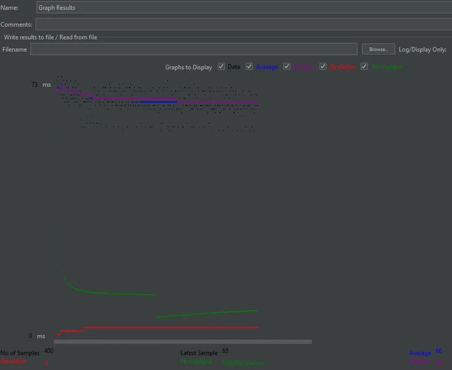

  ### **결과 분석**

  1. **응답 속도 및 안정성**
    - 평균 응답 시간이 66ms로 낮고, 편차(Deviation)가 3ms로 매우 작아 안정적인 성능을 나타냅니다.
    - 이는 현재 Redis 캐시가 효과적으로 요청을 처리하고 있음을 시사합니다.
  2. **Throughput**
    - 초당 약 13.2개의 요청을 처리하며, 이는 일반적인 소규모 트래픽에는 충분히 대응 가능한 수준입니다.
    - 하지만 사용자 수가 증가하거나 트래픽이 급증하면 병목현상이 발생할 가능성이 있습니다.
  3. **스케일링 및 확장성**
    - Throughput은 증가 가능한 한계점(예: Redis 노드 수, 네트워크 대역폭 등)에서 더 테스트해봐야 합니다.
    - Redis와 같은 인메모리 시스템에서 높은 캐시 적중률(Cache Hit Rate)을 유지하는 것이 중요합니다.

</details>

<details>
<summary><strong>동시성 제어</strong></summary>

> 도입
>

쿠폰 발급 API의 동시성 제어를 위해 비관적 락, 낙관적락, redisson 락을 각각 구현하고 성능을 테스트.  각 방식은 동시성 상황에서 데이터 정합성과 레이스 컨디션 문제를 해결했지만 요청이 들어온 순서대로 처리하는 공정성 문제는 해결하지 못했다. 이를 해결하기 위해 Redisson의 FairLock을 도입했으며 최종적으로 성능 저하를 감수하고도 FairLock을 선택했다.

> 문제 상황
>

쿠폰 발급 API는 다수의 동시 요청이 발생하는 로직으로 아래와 같은 요구사항을 충족해야 했다.

1. 데이터 정합성: 동시 요청으로 인해 쿠폰 수량이 초과 발급되지 않아야 함.
2. 요청 순서 보장: 먼저 쿠폰을 요청한 사용자에게 우선적으로 쿠폰을 발급해야 함.
3. 성능: 높은 동시 요청 환경에서도 허용 가능한 수준의 TPS를 유지해야 함.

> 성능 테스트 결과
>
- 테스트 환경
  - **테스트 도구**: nGrinder
  - **테스트 스크립트**: 로그인 후 쿠폰 발급 API 호출
  - **Processes/Threads**: 3 프로세스, 각 프로세스당 33 쓰레드
  - **Duration**: 1분 → 테스트는 1분간 진행
  - **Ramp-Up**: 비활성화 (즉시 99명의 사용자 부하 발생)

1. 비관적 락

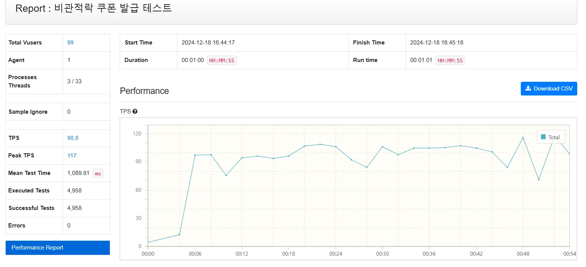

- TPS: 90.5
- Peak TPS: 117
- 평균 응답 시간: 1089.81ms
- 데이터 정합성은 확보했으나 요청 순서를 보장하지 못함.
- 트랜잭션 경합으로 인해 성능이 다소 저하.

1. 낙관적 락

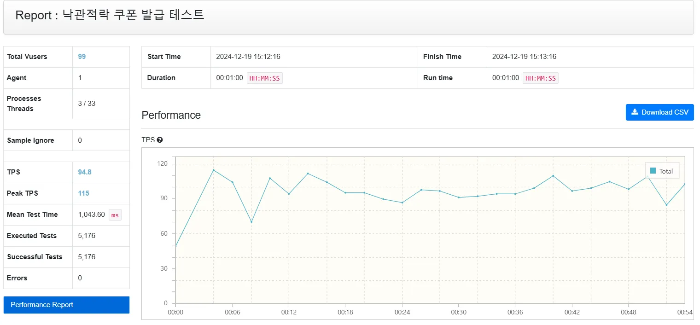

- TPS: 94.8
- Peak TPS: 115
- 평균 응답 시간: 1043.6ms
- 마찬가지로 요청 순서를 보장하지 못함.
- 충돌이 많은 환경에서 재시도로 인해 성능 저하 발생. 최대 62회의 재시도 관측.

1. Redisson 락

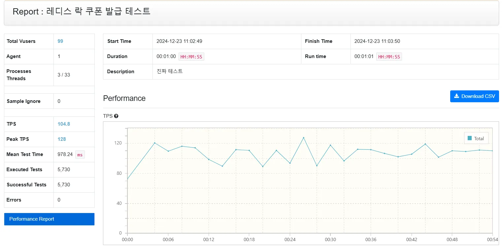

- TPS: 104.8
- Peak TPS: 128
- 평균 응답 시간: 978.24ms
- 높은 TPS를 기록하며 가장 우수한 성능을 보였으나 여전히 요청 순서를 보장하지 못함.

1. Redisson Fair Lock

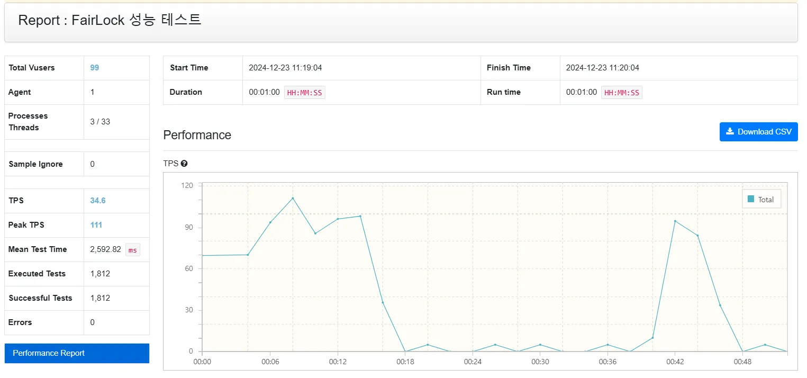

- TPS: 34.6
- Peak TPS: 111
- 평균 응답시간: 2592.82ms
- 요청 순서를 보장하지만 TPS가 기존 redisson 락의 1/3수준으로 감소.

> 장단점 분석
>
- 비관적락, 낙관적락 - 해당 lock은  DB 트랜잭션 단위로 락을 거는 방식이다.
  - 비관적락은 락이 해제될 때까지 다른 트랜잭션은 대기하는 방식으로 트랜잭션이 끝나지 않는 문제가 발생시 데드락이 우려된다.
  - 낙관적 락은 버전 충돌을 감지하고 재시도를 통해 데이터 갱신을 보장한다.

    경합이 적은 환경에서는 높은 성능을 제공할 수 있지만 쿠폰발급과 같은 환경은 필연적으로 경합이 발생한다. 그 결과 충돌이 발생하고 재시도로 인해 성능 저하가 일어났고 최대 62회까지 재시도가 발생하는 것을 확인했다. 그럼에도 비관적 락보다는 높은 성능이 나왔지만 더 많은 리소스가 사용 되는 것으로 보인다.


- Redisson 락 - Redis 메모리를 활용한 분산 락으로 RedissonClient를 통해 락 획득 및 해제를 처리한다.
  - redis 메모리 내에서 실행되므로 속도가 빠르고 db에 영향을 주지 않는다.
  - 기본으로 제공하는 분산락 (pub/sub) 방식으로 성능 이슈 없이 작동할 수 있다.
  - 가장 높은 성능을 보였으나 여전히 요청 순서를 보장하지 못해 공정성이 필요한 서비스에는 부적합했다.
- Redisson 페어락 -  RedissonClient의 Fair Lock 기능을 사용하여 요청 순서를 보장하는 락 구현.
  - FIFO 방식으로 락을 관리하여 요청이 들어온 순서대로 처리.
  - 요청 순서를 보장했으나 성능이 크게 감소.


> 최종 선택: Redisson Fair Lock
>
- 요청순서 보장 & 성능 저하 수용

  동시에 수많은 요청이 오는 것을 빠르게 처리하는 것도 중요하지만 쿠폰 발급의 특성상 한정된 쿠폰의 수량을 공정하게 먼저 요청한 순서대로 발급하는 것이 중요하다고 생각했다. 속도가 떨어지더도 먼저 요청을 했다면 쿠폰은 그 순서대로 갈 것이기 때문에 속도보다 요청을 순서대로 처리하는 공정성이 더 중요하다 판단했다.

  성능 저하 또한 현재 서비스에서 허용 가능한 수준으로 평가했다.

- 확장성 고려

  Redis 기반으로 분산 환경에서도 안정적으로 동작하며 추후 Redis Cluster를 통해 트래픽 증가 대비(스케일 아웃)가 가능하다.  (현재 비즈니스에서는 클러스터가 필요한 만큼 대용량 트래픽이 예상되지는 않는다.  오히려 서버 비용 낭비라는 생각이 들었다.)

</details>

<details>
<summary><strong>S3 이미지 업로드</strong></summary>

[배경]

사용자 프로필 사진이나 가게, 메뉴 이미지를 업로드할 때, 서버의 저장 공간을 효율적으로 관리하고 대규모 데이터를 안정적으로 처리하기 위해 AWS S3를 사용하기로 결정했습니다. S3는 확장성과 안정성을 갖춘 클라우드 스토리지 서비스로, 대용량 데이터 저장에 적합합니다.

[요구사항]

1. 사용자가 이미지를 업로드할 수 있도록 백엔드 API 설계 및 구현.
2. 이미지를 S3 버킷에 안전하게 저장하고 URL로 접근 가능하도록 설정.
3. S3에 업로드된 이미지에 대해 읽기 전용 액세스 권한을 설정하고, 민감한 데이터는 노출되지 않도록 보안 조치 적용.
4. 중복 방지 및 업로드된 파일의 URL 반환 기능 구현.
- **이미지 업로드 API 제공**: 사용자가 이미지를 업로드할 수 있도록 백엔드 API 설계 및 구현.
- **S3 버킷 연동**: 이미지를 S3 버킷에 안전하게 저장하고 URL로 접근 가능하도록 설정.
- **보안 강화**: S3에 업로드된 이미지에 대해 읽기 전용 액세스 권한을 설정하고, 민감한 데이터는 노출되지 않도록 보안 조치 적용.
- **업로드된 이미지 관리**: 중복 방지 및 업로드된 파일의 URL 반환 기능 구현.

[선택지]

1. 로컬 서버에 이미지 저장
  - 장점: 빠른 구현과 초기 비용 절감.
  - 단점: 서버 용량 한계와 확장성 부족, 데이터 유실 위험.
2. S3를 사용한 이미지 업로드
  - 장점: 무제한 확장성, 안정적이고 빠른 데이터 접근, 관리 효율성 증가.
  - 단점: 초기 설정 복잡도와 사용량에 따른 비용 발생.
3. CDN 연동을 통한 이미지 캐싱 및 배포
  - 장점: 빠른 로딩 속도 제공, 글로벌 사용자 경험 개선.
  - 단점: 추가적인 설정과 비용 증가.

[의사결정/사유]

S3를 사용한 이미지 업로드 방식을 선택했습니다.

- 서버 스토리지의 한계를 극복하고, 대량 데이터를 안정적으로 처리할 수 있는 솔루션이 필요했기 때문입니다.
- S3의 확장성과 안정성은 빠르게 성장하는 서비스에 적합하며, 업로드된 이미지를 S3 URL로 반환해 사용자가 쉽게 접근 가능하도록 구현했습니다.
- 또한 IAM 역할을 통해 액세스 제어를 강화하고, 업로드된 이미지의 보안을 유지했습니다.

[만약 다른 방식으로 개발한다면? / 처음으로 돌아간다면?]

- 만약 다른 방식으로 개발한다면?

  CDN 서비스(예: CloudFront)를 추가 연동해 이미지 로딩 속도를 더욱 최적화했을 것입니다.

- 처음으로 돌아간다면?

  S3 업로드와 함께 서버에서 이미지 크기 조정을 미리 처리하여 저장 공간을 효율적으로 활용했을 것입니다.

</details>

<details>
<summary><strong>회원 탈퇴 Soft Delete</strong></summary>

[배경]

회원탈퇴 시 데이터를 완전히 삭제하지 않고, 일정 기간 동안 복구 가능하도록 하기 위해 soft delete 방식을 선택했습니다. 이를 통해 데이터 유실을 방지하고, 사용자 요청에 따라 복구를 용이하게 처리할 수 있습니다.

[요구사항]

1. 사용자가 회원탈퇴를 요청하면, 회원 데이터를 즉시 삭제하지 않고 soft delete 상태로 전환.
2. Scheduler을 활용해 일정 시간이 지나 복구 요청이 없을 경우 데이터를 영구적으로 삭제하도록 구현.
3. 탈퇴 기간 내 사용자가 복구를 요청할 경우 계정을 활성화 상태로 복구.

[선택지]

1. 즉시 영구 삭제
  - 장점: 간단한 구현 및 데이터 관리 용이.
  - 단점: 사용자 요청 시 복구 불가.
2. soft delete와 scheduler를 활용한 지연 삭제
  - 장점: 데이터 복구 가능성 제공, 탈퇴 유예 기간 활용 가능.
  - 단점: 구현 복잡도 증가 및 데이터 보존 비용 발생.
3. soft delete 사용
  - 장점: 복구 가능성 제공 및 간단한 구현.
  - 단점: 데이터가 쌓여 관리 복잡도가 증가 가능.

[의사결정/사유]

soft delete와 scheduler를 활용한 지연 삭제

- 회원의 요청에 따라 복구 가능성을 제공해 사용자 경험을 개선하고자 함.
- Scheduler를 통해 자동으로 데이터 삭제 작업을 처리해 관리 효율성을 높임.
- 데이터 유실로 인한 분쟁을 방지하기 위해 유예 기간을 설정.

[만약 다른 방식으로 개발한다면? ]

Scheduler 없이 관리자 인터페이스에서 데이터 삭제를 수동으로 처리하도록 변경할 수 있음. 이 경우 관리 부담이 증가하지만, 데이터 삭제 시점에 대한 유연성을 확보 가능.

</details>

<details>
<summary><strong>왜 Redis Pub/Sub인가?</strong></summary>

프로젝트에서의 요구사항은 “사장이 주문 상태를 변경하면, 회원에게 변경된 상태 정보가 담긴 메세지 전달” 이라는 간단한 조건이었습니다. 메세지를 보내는 방식이나, 메세지에 담긴 정보가 간단한 상황이었습니다.

[Redis 의 Pub/Sub 선택]
Redis Pub/Sub 은 설정 및 구현이 비교적 간단하고, 즉시 사용하기 좋습니다. 별도의 브로커 설치나 복잡한 설정이 필요하지 않아서 초기 개발을 마무리 하고 성능적인 측면에서의 개선과 테스트하기 유리합니다. 그리고 가볍고 직관적인 구조로 간단한 실시간 메시징 요구사항에 적합하다고 판단하였습니다.

또한, Redis 는 메모리 기반 데이터저장소로, Pub/Sub 의 메시징 속도가 매우 빠릅니다. 그리고 낮은 지연시간(Latency)으로, 실시간 알림과 같은 가벼운 메시징 작업에 적합합니다.

현재 요구사항에서는 매우 간단한 정보를 담고 있는 메시지이기 때문에, 복잡한 메시지 라우팅이 필요하지 않고, 이것은 Redis 로 충분히 안정적이고 신뢰할 수 있는 시스템을 구현가능합니다.

최종적으로 Redis 는 이미 캐싱 등에서 사용되고 있어, 확장하여 적용하기 용이합니다. 이렇게 되면 추가적인 메시징 브로커를 운영할 필요 없이 기존 인프라를 활용할 수 있어서 비용과 관리 복잡도가 감소합니다.

Redis 말고도 메시지를 관리하는 MQ(메시지 큐, 메세지 브로커)방식이 존재하지만 사용하지 않은 추가적인 이유는 현재 조건이 충분히 Redis 에도 부합하고, MQ는 오버엔지니어링이라는 판단이 들어서 입니다. 또한 Kafka 나 RabbitMQ 를 선택하면 고가용성을 위해 다수의 노드가 필요하게 되고 관리하는데 있어서 추가적인 비용이 들게 되고, 기술적으로 학습하는 것에 대한 비용도 들게 되기 때문에 채택하지 않았습니다.

[추후 개선이 된다면?]

추후에 프로젝트의 요구사항이 확대되고, 분산 서비스를 구축해야하는 상황이 생기게 된다면, 또는 메시지가 담고있는 정보의 양 달라지거나 메시지 라우팅에 있어서 복잡한 과정이 생긴다면 Kafka 나 RabbitMQ 를 이용하여 별도의 메세지 브로커를 도입할 필요가 있다고 생각이 듭니다.

</details>

<details>
<summary><strong>왜 WebSocket인가?</strong></summary>

**[문제 인식]**

1. 하나의 가게에만 1~100개 가량의 채널이 발생할 수 있고, 이런 채널이 가게마다 연결로 이루어 진다면 Redis 서버에 과부하가 걸릴 수 있다. → **과도한 구독 유지 비용**
2. Redis 서버의 부하를 줄이기 위해 추후 Redis 클러스터링으로 노드를 확장시켜야 하는데, Redis Pub/Sub 은 노드간 메세지 전달이 불가능하다. → **확장성에 문제가 있음**
3. 사용자 상태를 관리하거나 인증, 구독 해제 등의 로직을 별도로 구현해야한다. → **복잡한 사용자 연결관리**
4. Redis 의 Pub/Sub 구조에서는 구독자가 연결 되지 않는 경우 발행한 메세지가 손실되어버릴 수 있다. → **오프라인 구독자**는 메세지를 아예 받아보지 못하거나, 이런경우 **보존이 불가능**

---

위 문제점 중에서, 메세지의 재전송이나 인증이나 연결을 관리하는 로직의 경우는, Redis 단에서도 처리가 가능하지만 적잖은 불편함이 있고, 프로젝트 전반적으로 Redis 서버가 실시간 알림에서만 사용되는 것도 아닐뿐더러 1번 2번 상황에서 Redis 에 부하가 걸리면 사용자 경험에 있어서 큰 문제가 발생할 수 있다고 판단하였습니다.
최종적으로, 보조적인 통신 장치 및 추가적인 기능을 위해 WebSocket 을 채택하여 사용하도록 하였습니다.

---

**[WebSocket 의 필요성]**

1. WebSocket 은 서버와 클라이언트 간 양방향 실시간 통신을 지원하고, 클라이언트가 요청을 보내지 않아도 서버에서 데이터를 푸시할 수 있습니다.
2. 클라이언트가 연결된 상태를 실시간으로 확인할 수 있으므로, 사용자 경험 측면에서 개선됩니다.
3. WebSocket 은 클라이언트의 상태를 유지하면서, 연결 수명 동안 사용자 인증 정보를 포함해서 들고있습니다. 이를 통해서 연결의 무결성과 보안을 강화할 수 있습니다.
4. 단순한 Pub/Sub 외에도 사용자 별 채널, 가게 별 채널, 그룹 채널 등 구현 확정성이 좋습니다.

위의 장점들을 활용하여 Redis Pub/Sub 을 WebSocket 과 조합해서 사용하면 장점을 극대화 해서 사용할 수 있다는 판단이 들었습니다.

추가적으로 클라이언트 연결 관리는 WebSocket 이 담당하도록 책임을 분리할 수 있고, 상태나 인증, 메세지 포맷 등을 관리하기 좋습니다. 또한 서버간의 메세지 전달에 Redis 를 사용하고 WebSocket 서버가 Redis 에서 메세지를 수신하여 클라이언트에서 전달하는 방식으로 비동기적 메세지 처리나 손실된 메세지를 검증하고 재전송하기도 쉬워집니다.

</details>

---

# 🛠 트러블 슈팅

<details>
<summary><strong>Redis 직렬화/역직렬화 문제</strong></summary>

[문제 인식]

직렬화와 역직렬화는 데이터를 Redis에 저장하거나 읽어오는 과정에서 발생하는 핵심 문제발생.

1. **Redis에 데이터를 직렬화할 때**: Java 객체를 JSON 형식으로 변환하는 과정.
2. **Redis에서 데이터를 읽어올 때**: JSON 문자열을 Java 객체로 변환하는 과정.
3. 주요 원인
- `GenericJackson2JsonRedisSerializer`가 올바르게 설정되지 않음.
- `ObjectMapper`의 설정 불일치로 인해 필드가 매핑되지 않음.

[문제 해결 과정]

- RedisTemplate 직렬화 확인

<aside>
💡

@Bean
public RedisTemplate<String, List<PopularStoreResponse>> redisTemplate2(RedisConnectionFactory connectionFactory) {

RedisTemplate<String, List<PopularStoreResponse>> template = new RedisTemplate<>();
template.setConnectionFactory(connectionFactory);
template.setKeySerializer(new StringRedisSerializer());
template.setValueSerializer(new GenericJackson2JsonRedisSerializer());
return template;
}

</aside>

- ObjectMapper 설정 : 직렬화/역직렬화 오류 방지

<aside>
💡

@Bean
public ObjectMapper objectMapper() {
ObjectMapper objectMapper = new ObjectMapper();
objectMapper.configure(DeserializationFeature.FAIL_ON_UNKNOWN_PROPERTIES, false);
objectMapper.setVisibility(PropertyAccessor.FIELD, JsonAutoDetect.Visibility.ANY);
return objectMapper;
}

@Bean
public GenericJackson2JsonRedisSerializer genericJackson2JsonRedisSerializer(ObjectMapper objectMapper) {
return new GenericJackson2JsonRedisSerializer(objectMapper);
}

</aside>

- JSON 필드 이름이 Java 클래스의 필드 이름과 정확히 일치하지 않아도 역직렬화가 가능.

- Redis -cli > GET popularStores 를 통해  데이터를 확인.
- Redis 에 저장된 Json 데이터는 다음과 같다.

<aside>
💡

[
{
"storeId": 55,
"storeName": "test Store",
"image": "test Image",
"description": "한식안팎니다",
"averageScore": 0.0,
"orderCount": 20
}
]

</aside>

올바르게 매핑 되지 않은게 가장 큰 문제로 사료된다.

여기 저기서 redistemlpate 을 쓰다보니 문제가 발생하였다.

</details>

<details>
<summary><strong>Redis cache 적용에 관해서</strong></summary>

[문제 인식 및 해결 방안]

### **TTL 및 데이터 동기화**

- **문제**: TTL 설정과 데이터 갱신 간의 불일치로 인해 캐시 만료 후 요청이 DB로 몰릴 가능성.
- **해결 방안**:
  - 갱신 주기를 적절히 설정하고, 캐시 만료 전에 새 데이터를 미리 갱신하는 Pre-warming 전략 도입.

    <aside>
    💡

  @Scheduled(fixedRate = 3600000) // 매 1시간마다 실행
  public void preWarmCache() {
  String key = "popular_stores";
  String newData = fetchPopularStoresFromDb(); // DB에서 최신 데이터 조회
  redisTemplate.opsForValue().set(key, newData, Duration.ofHours(1));
  }

    </aside>


[미래를 위한]

### **스케일링을 위한 Redis Cluster 구성**

- **문제**: 요청량 증가에 대비하지 않으면 단일 Redis 인스턴스가 병목현상이 될 수 있음.
- **해결 방안**:
  - Redis Cluster 또는 AWS ElastiCache 사용으로 캐시의 확장성과 가용성 확보.
  - **결정 요소**:
    - Redis 샤딩(Sharding)을 통해 키 공간을 분산.
    - 인기 가게 데이터는 Redis의 `Sorted Set`을 사용해 정렬 기준(조회수, 평점 등)을 동적으로 관리.

</details>

<details>
<summary><strong>S3 → S3+Cloud Front</strong></summary>

[문제 인식]

- S3를 단독으로 사용했을 때, 해외 사용자 대상 서비스에서 발생하는 성능 문제와 보안상의 문제가 있을수 있을거라 생각함
  - 성능 문제 : S3는 물리적 서버 위치에 따라 응답 속도가 달라지며, 전 세계 사용자에게 일관된 빠른 속도를 제공하기 어려움.
  - 보안 : S3 버킷 이름이 노출되거나 잘못된 접근 권한 설정 시, 데이터 유출 위험 증가.

[해결 방안]

- Cloud Front 도입
  - S3에 저장된 콘텐츠를 CloudFront 서버를 통해 캐싱 및 배포하여 글로벌 사용자에게 빠르고 안정적인 서비스를 제공.
- 보안
  - S3 버킷에 직접 접근을 차단하고, CloudFront를 통해서만 접근 가능하도록 설정.

[해결 완료]

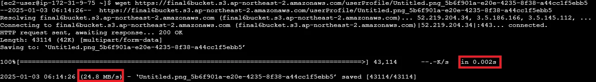
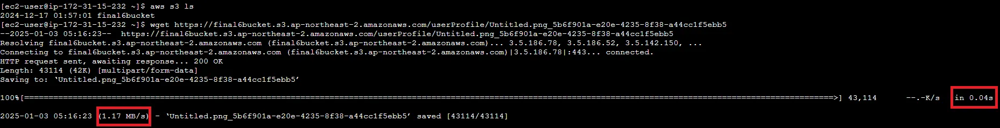

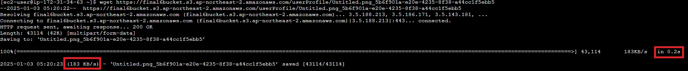

순서대로 한국 일본 캘리포니아 프랑크푸르트에서 테스트한 결과이다

S3만 단독으로 사용했을때의 결과이고 아래표로 확인이 가능하다

| 한국 | 24.8MB/s  0.002s |
| --- | --- |
| 일본 | 1.17MB/s 0.04s |
| 캘리포니아 | 312KB/s 0.1s |
| 프랑크푸르트 | 183KB/s 0.2s |

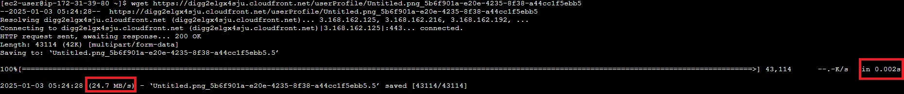
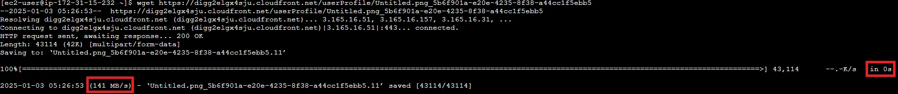
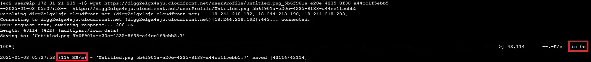
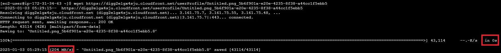

이건 Cloud Front를 도입했을때의 결과이다

| 한국 | 24.7MB/s  0.002s |
| --- | --- |
| 일본 | 141MB/s 0s |
| 캘리포니아 | 116MB/s 0s |
| 프랑크푸르트 | 204MB/s 0s |

한국에서의 속도는 비슷한 반면 다른 지역에서의 속도는 확연히 차이가 난다

| 지역 | S3 | S3+Cloud Front |
| --- | --- | --- |
| 한국 | 24.8MB/s  0.002s | 24.7MB/s  0.002s |
| 일본 | 1.17MB/s 0.04s | 141MB/s 0s |
| 캘리포니아 | 312KB/s 0.1s | 116MB/s 0s |
| 프랑크푸르트 | 183KB/s 0.2s | 204MB/s 0s |

위 표를 통해서 해외 사용자 대상 서비스에서 발생하는 성능 문제가 어느정도 해결이 되었다 생각한다.

그리고 S3만 사용했을때는 버킷이름이 노출이 되었는데 CloudFront 사용시 버킷이름의 노출을 방지해 보안 강화도 되었다.

프로젝트에서 필요한게 이미지파일 뿐이라 크기가 작아 0.1~2s 면 완료가 되는데

이미지파일말고 다른 큰 파일을 사용하는 곳에 사용하면 속도차이가 눈에 보이게 다를것이라 생각한다.

</details>

<details>
<summary><strong>FairLock을 활용한 요청 순서 보장 문제</strong></summary>

- FairLock을 활용한 요청 순서 확인 문제

  > 문제
  >

  Redisson의 `FairLock`을 사용하여 요청 순서를 보장하려 했으나 적용 후에도 여전히 요청 순서와 완료 처리 순서가 뒤죽박죽이었다.

  > 원인
  >

    ```
    Thread 시작: 70
    Thread 시작: 63
    Thread 시작: 61
    ...
    Thread 완료: 61
    Thread 완료: 70
    Thread 완료: 63
    ...
    ```

  이러한 로그를 보고 FairLock이 제대로 동작하지 않는다고 판단했었다. 그러나 테스트 코드의 `Thread 시작` 로그는 실제 락 처리 순서를 반영하지 않았다.

  > 해결 과정
  >

  락 대기중 로그와 락 획득 로그를 비교해 FairLock이 요청 순서를 정확히 보장하고 있음을 확인했다.

  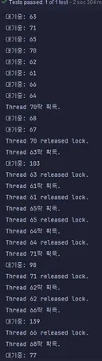

  1. **대기 중 순서**:

      ```
      63, 71, 65, 70, 62, 61, 66, 64, 68, 67, 103, 98, 139...
      ```

  2. **락 획득 순서**:

      ```
      70, 63, 61, 65, 64, 71, 62, 66, 68, 67, 103, 98, 139...
      ```


    초기 8개의 스레드는 락 대기 순서와 락 획득 순서가 불일치했으나 68번 스레드부터 이후 모든 스레드는 락 대기 순서대로 락을 획득하고 있었다.
    
    초기 순서 불일치는 스레드 스케줄링의 비결정성과 로그 출력 시점과 락 처리의 비동기적 특성에 의해 발생한 것으로 보인다.
    
    > 결론
    > 
    - Redisson FairLock은 요청 순서를 보장
        
        FairLock은 Redis 대기열을 기반으로 락 획득 순서를 보장한다는 점이 확인됐다. 초기 혼란은 테스트 로그가 실제 순서를 정확히 반영하지 않았기 때문이었다.
        
    - 초기 순서 불일치는 자연스러운 현상
        
        스레드 스케줄링과 Redis 통신의 비동기적 특성으로 초기 몇개의 스레드에서는 대기 순서와 락 획득 순서가 다를 수 있다. 그러나 이후부터는 락 대기열에 따라 순서가 명확히 유지된다.

</details>

---

